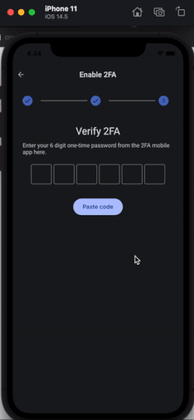

# verification_code_flutter [](https://pub.dev/packages/verification_code_flutter)

- A Flutter package that help you create a verification input.

- Based on https://github.com/awaik/flutter_verification_code.git

- change item size double to customize the width and height Size(50, 60)

- change fullBorder to full property

- add showUnderline property to show or hide underline

- add showBorder property to show or hide border

- add borderRadius property to customize border radius

- change edit filed center align

After install, in your Dart code, you can use:

```dart
import 'package:verification_code_flutter/verification_code_flutter.dart';
```

## Usage

```dart
  VerificationCode(
    textStyle: TextStyle(fontSize: 20.0, color: Colors.red[900]),
    keyboardType: TextInputType.number,
    underlineColor: Colors.amber, // If this is null it will use primaryColor: Colors.red from Theme
    length: 4,
    cursorColor: Colors.blue, // If this is null it will default to the ambient
    // clearAll is NOT required, you can delete it
    // takes any widget, so you can implement your design
    itemSize: const Size(50, 60), // default is Size(50, 50)
    clearAll: Padding(
      padding: const EdgeInsets.all(8.0),
      child: Text(
        'clear all',
        style: TextStyle(fontSize: 14.0, decoration: TextDecoration.underline, color: Colors.blue[700]),
      ),
    ),
    onCompleted: (String value) {
      setState(() {
        _code = value;
      });
    },
    onEditing: (bool value) {
      setState(() {
        _onEditing = value;
      });
      if (!_onEditing) FocusScope.of(context).unfocus();
    },
  ),
```

```dart
onEditing: (bool value) {
  setState(() {
    _onEditing = value;
  });
},
```

```dart
Center(
  child: (_onEditing != true)
      ? Text('Your code: $_code')
      : Text('Please enter full code'),
),
```

## How to use feature with pasting a code
The example is here https://github.com/honorjoey/verification_code_flutter/issues

Full example is here https://github.com/honorjoey/verification_code_flutter/tree/main/example

## Showcase




